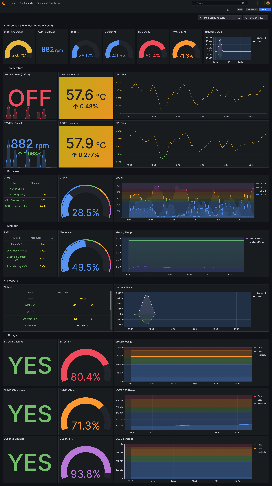
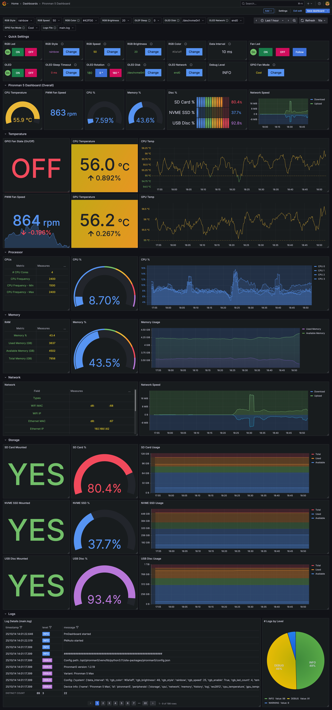
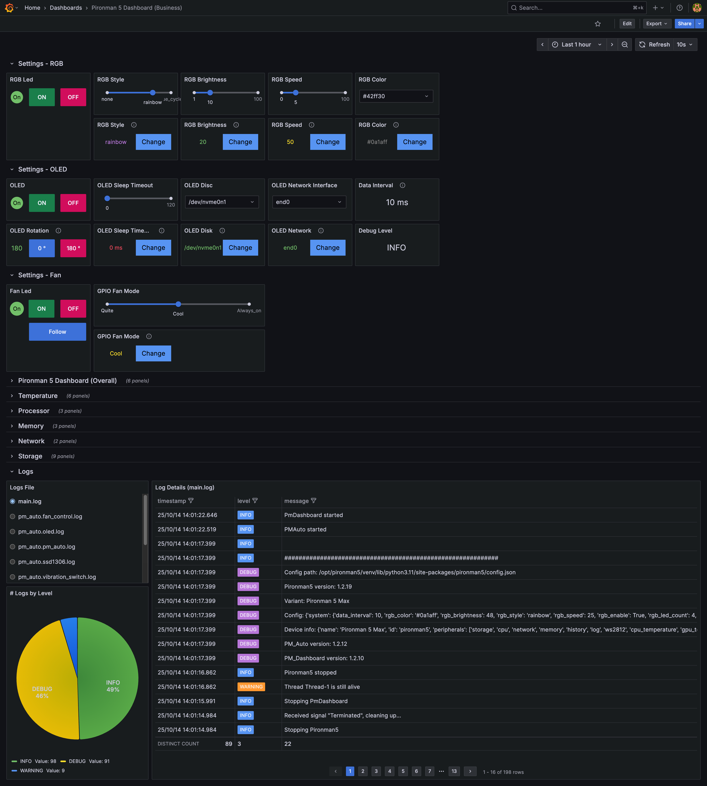
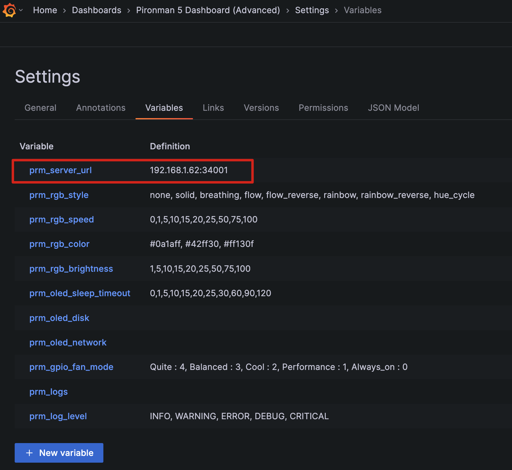
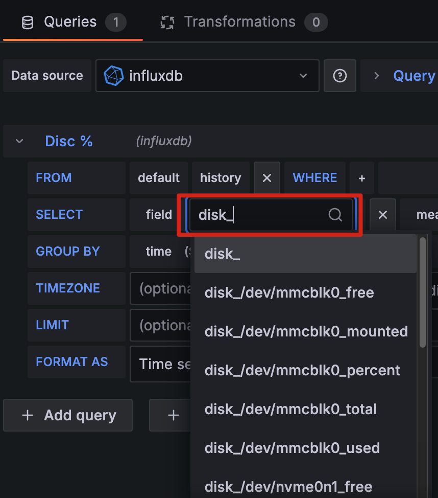

# Pironman Dashboard (Grafana)

A more visual, fancy, and resource-efficient dashboard in Grafana which is an alternative to the [pm_dashboard_www](https://github.com/sunfounder/pm_dashboard_www) application that displays sensor data generated by [Pironman - pm_dashboard](https://github.com/sunfounder/pm_dashboard) in influxdb.

> Use this Grafana dashboard, especially if pm_dashboard_www is malfunctioning after a while, failing to display sensor data, and giving errors like below or just for fun :-D

**pm_dashboard issues/errors:**

* [Pironman 5 Dashboard empty](https://forum.sunfounder.com/t/pironman-5-dashboard-empty/1218/51)
* [WARNING] Too many nulls in the result of the query: SELECT * FROM history ORDER BY time DESC LIMIT 20, trying again...
* [Request to /api/v1.0/get-data and fails with error 404 Not found](https://github.com/sunfounder/pm_dashboard/issues/1)
* The server responded with a status of 404 (NOT FOUND) :34001/api/v1.0/get-data

**Solution:**

* Grafana dashboard to visualize the sensor data recorded at influxdb with more robust and resource efficient way
  * [Simple Dashboard](#simple-dashboard)
* Grouping different sensor widgets/panels
* Responsive design for Mobile, Web
* Visualization and Control the application via REST APIs at the same UI
  * [Advanced Dashboard](#advanced-dashboard)
  * [Business Dashboard](#business-dashboard)
* Auto Refresh by different time intervals like 1s, 5s, 10s, 30s ...
* Sensor widgets for Temperature, Fan, Processor, Memory, Network, Storage
* Alert & Notification definition capability by the thresholds
* **Recommended** Retention Policy & Wirte/Read optimization for InfluxDB - [forum link](https://forum.sunfounder.com/t/pironman-5-dashboard-empty/1218/51?u=fxerkan) please apply these instructions

## Simple Dashboard

* Simple and easy UI, just shows only the sensor readings



## Advanced Dashboard

* Everything in Simple Dashboard +
* Advanced and detailed UI design with the variables, buttons and actions
* **Control** the pironman application settings via **REST API**
  * OLED Control - On/Off, Sleep Timout, Rotation, Disk & Network interface selection
  * RGB Led Control - On/Off, Style, Speed, Brightness, Color
  * Fan Control - Led On/Off/Follow, Fan Mode
* **Logs Panel** to show the detailed logs of the selected **Log File**

Please first change or select the **New Option/Configs** from the top **Variables bar** for the specific config and than click the related config's **Change** button at the below **Quick Settings** panel.



## Business Dashboard

The "Business Dashboard" is actually enhanced version of the [Advanced Dashboard](#advanced-dashboard) that uses the "[Business Variable](https://grafana.com/grafana/plugins/volkovlabs-variable-panel/)" plugin to make parameter/variable selections much more user-friendly.

*Unfortunately, the name remained Business Dashboard due to the Business Variable plugin I used, but there is no Business content :-)

* It includes user-friendly components allows for more easier parameter changing on mobile/tablet.
* Slider panel
* Dropdow list panel



## Installation & Configuration

### InfluxDB

> 1. Create Credentials for InfluxDB (**Recommended**)

Please create a user and password for the influxdb and use this credentials at Grafana influx connection.

```bash
influx
> CREATE USER "pironman" WITH PASSWORD 'pironman-your-strong-password' WITH ALL PRIVILEGES
> exit
```

### Grafana

* Create **InfluxDB** data source
  * **URL :** [http://localhost:8086](http://localhost:8086) or http://ip-address-rpi:8086
  * **Name :** *pironman_influxdb*
  * **Database :** ***pironman5***
  * **Username :** *pironman*
  * **Password :** *pironman-your-strong-password*
* Install **[Infinity](https://grafana.com/docs/plugins/yesoreyeram-infinity-datasource/latest/setup/installation/)** data source **plugin**
* Install **[Business Variable](https://grafana.com/grafana/plugins/volkovlabs-variable-panel/)** **plugin**
* Creaate **Infinity** data source
  * **Name :** *pironman_api*
  * **Auth type :** *No Auth*
  * **Base URL :** *[http://localhost:34001/api/v1.0/](http://localhost:34001/api/v1.0/) or http://ip-address-rpi:34001/api/v1.0/*
* **Import** the Grafana Dashboard (JSON) files
* Change the "**prm_server_url**" variable with your raspberry pi server IP address (without http:// or https://) from the Dashboard > Settings > Variables
  * **prm_server_url :** *localhost:340001 or ip-address-rpi:34001*
  * 
* **Important:** You can have different Storage, Network Interfaces so that you may need to change some of the charts influxdb queries depends on your interfaces.
  *  If you see this error triangle icon inside the panel, please apply the below steps
  * For example if you don't have the NVME SSD drive than “**disk_/dev/nvme0n1_percent**” field should not be available or field name should be different like maybe “disk_/dev/nvme1n1_percent” or “***disk_/dev/sda_percent***” or “***disk_/dev/sdb_percent***”. In that case please change the field names with yours like below.
  * 

## Troubleshoot

* If you see any IP address like this 192.168.1.62:34001 or URL exception please check the prm_server_url variable and change it with your pironman (raspberry pi) server IP address.
